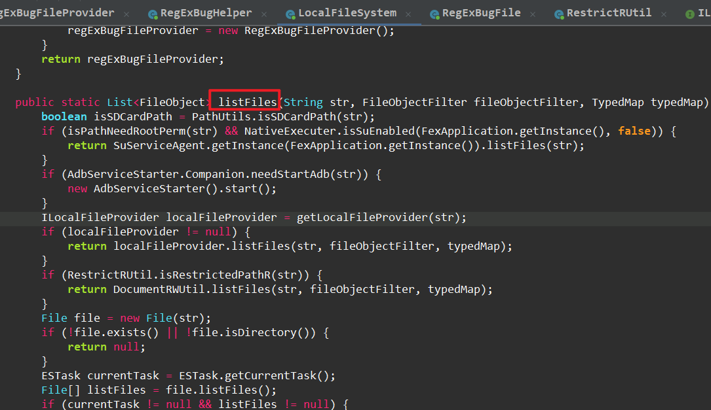
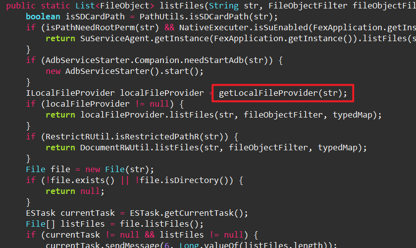
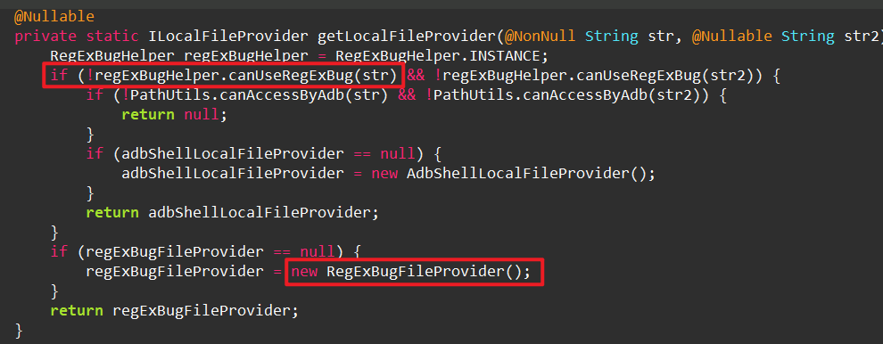
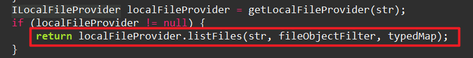
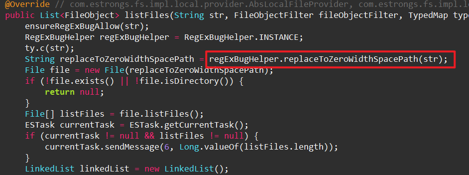

安卓14 Android/data 目录访问指南

本仓库提供了一个资源文件，帮助你在安卓14系统中直接访问Android/data目录，无需使用Shizuku或进行复杂的授权操作。通过利用安卓系统现有的漏洞，你可以像在安卓10系统中一样直接访问Android/data目录，或者像在安卓11系统中一样通过简单的授权操作来访问。

- 本资源文件利用了安卓系统现有的漏洞，因此在使用时请注意系统的安全性和稳定性。
- 由于安卓系统的更新可能会修复这些漏洞，因此请确保你的系统版本与资源文件兼容。
- 本资源文件仅供学习和研究使用，请勿用于非法用途。
/Android/data目录存储了很多有用的数据，比如微信的语音消息，接受的微信文件等，但是Android10开始，访问Android/data目录就受到了很多限制，需要手动授权单个包的访问权限，安卓14以后没法授权
但是在使用mt管理器和es文件夹浏览器的时候发现，这些APP不需要弹出SFA窗口就能够直接访问/Android/data目录，本文分析了es文件夹浏览器怎么实现这个功能的
通过分析文件浏览器，发现了mt和es文件浏览器怎么免授权访问Android/data目录



入口都是LocalFileSystem的listFiles，然后调用getLocalFileProvider



判断是否能使用正则表达式漏洞，如果能够使用，就返回实例化的regExBugFileProvider



接着调用RegExBugFileProvider的listFiles方法



在RegExBugFileProvider的listFiles中，获取RegExBugHelper的示例INSTANCE，然后对传入的路径进行replaceToZeroWidthSpacePath操作



这里把整个方法复制出来

```java
 public final String replaceToZeroWidthSpacePath(String str) {
        int C;
     	// 确保路径不为空，否则抛异常
        ty.e(str, "path");
     	// 处理 /Android/data/ 路径
        if (StringsKt__StringsKt.q(str, RestrictRUtil.RESTRICTED_ANDROID_DATA_R, false, 2, null)) {
            // 找到 "/Android/data/" 在字符串中的索引
            int C2 = StringsKt__StringsKt.C(str, RestrictRUtil.RESTRICTED_ANDROID_DATA_R, 0, false, 6, null);
            if (C2 == -1) {
                return str;// 没找到，直接返回原路径
            }
            StringBuilder sb = new StringBuilder();
            String substring = str.substring(0, C2);
            ty.d(substring, "(this as java.lang.Strin…ing(startIndex, endIndex)");
            sb.append(substring);
            sb.append((char) 8203);// 插入零宽空格字符
            String substring2 = str.substring(C2);
            ty.d(substring2, "(this as java.lang.String).substring(startIndex)");
            sb.append(substring2);
            return sb.toString();
        }
     	// 处理 /Android/obb/ 路径
        if (!StringsKt__StringsKt.q(str, RestrictRUtil.RESTRICTED_ANDROID_OBB_R, false, 2, null) || (C = StringsKt__StringsKt.C(str, RestrictRUtil.RESTRICTED_ANDROID_OBB_R, 0, false, 6, null)) == -1) {
            return str;
        }
        StringBuilder sb2 = new StringBuilder();
        String substring3 = str.substring(0, C);
        ty.d(substring3, "(this as java.lang.Strin…ing(startIndex, endIndex)");
        sb2.append(substring3);
        sb2.append((char) 8203);
        String substring4 = str.substring(C);
        ty.d(substring4, "(this as java.lang.String).substring(startIndex)");
        sb2.append(substring4);
        return sb2.toString();
    }

```

上面能够实现一种什么效果呢，在全路径中插入了一个零宽空格字符

```
str = /storage/emulated/0/Android/data/com.estrongs.android.pop/
result str = /storage/emulated/0/\u200BAndroid/data/com.estrongs.android.pop/
```

也就是说只要在全路径中插入零宽空格就能绕过系统限制。我们写一个app测试一下，能不能成功

示例代码

```java
//判断是否存在bug 
public final boolean fsHasRegExBug() {
        if (Build.VERSION.SDK_INT < 30) {
            return false;
        }
        if (mFsHasRegExBug == null) {
            File externalStorageDirectory = Environment.getExternalStorageDirectory();
            mFsHasRegExBug = Boolean.valueOf(Arrays.equals(new File(externalStorageDirectory, "Android").list(), new File(externalStorageDirectory, "\u200bAndroid").list()));
        }
        Boolean bool = mFsHasRegExBug;
        ty.c(bool);
        return bool.booleanValue();
    }

//判断目录是否需要使用bug
public final boolean canUseRegExBug(String str) {
        if (enableByCloud() && str != null && Build.VERSION.SDK_INT >= 30 && fsHasRegExBug()) {
            return RestrictRUtil.isInternalRestrictedPathR(str, true);
        }
        return false;
    }

//返回是否是指定目录
@WorkerThread
    public static boolean isInternalRestrictedPathR(String str, boolean z) {
        String storageSubPath;
        if (TextUtils.isEmpty(str)) {
            return false;
        }
        String convertToSDCardFullPath = PathUtils.convertToSDCardFullPath(str);
        if (convertToSDCardFullPath.endsWith("/")) {
            convertToSDCardFullPath = convertToSDCardFullPath.substring(0, convertToSDCardFullPath.length() - 1);
        }
        if (PathUtils.isExternal2File(convertToSDCardFullPath) || Build.VERSION.SDK_INT < 30 || (storageSubPath = getStorageSubPath(convertToSDCardFullPath)) == null) {
            return false;
        }
        String[] split = storageSubPath.split("/");
        if (split.length < 2 || !split[0].equals("Android")) {
            return false;
        }
        if (split[1].equals("data") || split[1].equals("obb")) {
            return z || split.length == 2;
        }
        return false;
    }


//实例化利用类
@Nullable
    private static ILocalFileProvider getLocalFileProvider(@NonNull String str, @Nullable String str2) {
        RegExBugHelper regExBugHelper = RegExBugHelper.INSTANCE;
        if (!regExBugHelper.canUseRegExBug(str) && !regExBugHelper.canUseRegExBug(str2)) {
            if (!PathUtils.canAccessByAdb(str) && !PathUtils.canAccessByAdb(str2)) {
                return null;
            }
            if (adbShellLocalFileProvider == null) {
                adbShellLocalFileProvider = new AdbShellLocalFileProvider();
            }
            return adbShellLocalFileProvider;
        }
        if (regExBugFileProvider == null) {
            regExBugFileProvider = new RegExBugFileProvider();
        }
        return regExBugFileProvider;
    }

//bug利用类的重载方法
@Override // com.estrongs.fs.impl.local.provider.AbsLocalFileProvider, com.estrongs.fs.impl.local.provider.ILocalFileProvider
    public List<FileObject> listFiles(String str, FileObjectFilter fileObjectFilter, TypedMap typedMap) throws FileSystemException {
        ensureRegExBugAllow(str);
        RegExBugHelper regExBugHelper = RegExBugHelper.INSTANCE;
        ty.c(str);
        String replaceToZeroWidthSpacePath = regExBugHelper.replaceToZeroWidthSpacePath(str);
        File file = new File(replaceToZeroWidthSpacePath);
        if (!file.exists() || !file.isDirectory()) {
            return null;
        }
        File[] listFiles = file.listFiles();
    }

//替换
public final String replaceToZeroWidthSpacePath(String str) {
        int C;
        ty.e(str, "path");
        if (StringsKt__StringsKt.q(str, RestrictRUtil.RESTRICTED_ANDROID_DATA_R, false, 2, null)) {
            int C2 = StringsKt__StringsKt.C(str, RestrictRUtil.RESTRICTED_ANDROID_DATA_R, 0, false, 6, null);
            if (C2 == -1) {
                return str;
            }
            StringBuilder sb = new StringBuilder();
            String substring = str.substring(0, C2);
            ty.d(substring, "(this as java.lang.Strin…ing(startIndex, endIndex)");
            sb.append(substring);
            sb.append((char) 8203);
            String substring2 = str.substring(C2);
            ty.d(substring2, "(this as java.lang.String).substring(startIndex)");
            sb.append(substring2);
            return sb.toString();
        }
        if (!StringsKt__StringsKt.q(str, RestrictRUtil.RESTRICTED_ANDROID_OBB_R, false, 2, null) || (C = StringsKt__StringsKt.C(str, RestrictRUtil.RESTRICTED_ANDROID_OBB_R, 0, false, 6, null)) == -1) {
            return str;
        }
        StringBuilder sb2 = new StringBuilder();
        String substring3 = str.substring(0, C);
        ty.d(substring3, "(this as java.lang.Strin…ing(startIndex, endIndex)");
        sb2.append(substring3);
        sb2.append((char) 8203);
        String substring4 = str.substring(C);
        ty.d(substring4, "(this as java.lang.String).substring(startIndex)");
        sb2.append(substring4);
        return sb2.toString();
    }

```

